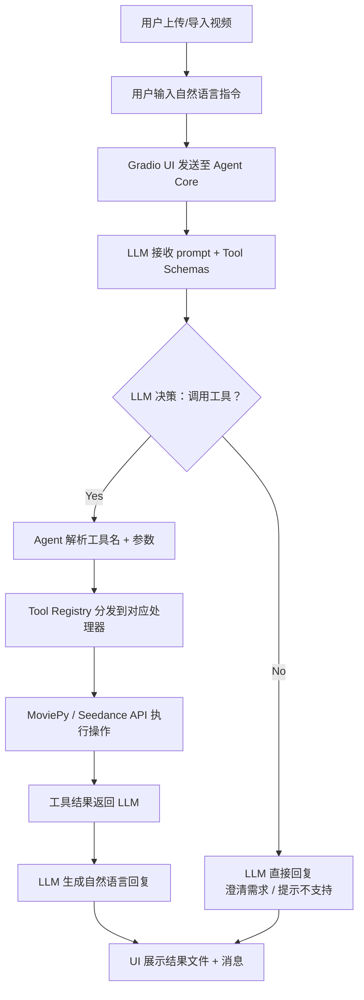

# AI Video Copilot

基于大语言模型 Function Calling 机制构建的 **AI Agent 视频处理平台**。用户通过自然语言描述需求，LLM 自动决策调用哪个工具并执行，实现「对话即操作」的智能视频工作流。

系统支持三大核心场景：**本地视频剪辑**（裁剪、提取音频、转 GIF）、**AI 视频生成**（豆包 Seedance）和 **多平台视频导入**（抖音/TikTok 等），通过 Gradio 提供可视化 Web 交互界面，并支持前端动态配置 API Key。

> 本项目为 GitHub Portfolio 项目，展示 Agent 架构、Tool Calling 工作流和生产级 Python 工程实践。

## 功能一览

| 功能 | 说明 | 输出 |
|------|------|------|
| **裁剪视频** | 按时间范围裁切视频片段 | `.mp4` |
| **提取音频** | 从视频中分离音频轨道 | `.mp3` |
| **视频转 GIF** | 将视频片段转为动图 | `.gif` |
| **AI 生成视频** | 根据文字描述生成短视频（豆包 Seedance 1.5 Pro） | `.mp4` |
| **URL 导入视频** | 从抖音分享链接直接导入视频（无需 Cookies） | `.mp4` |

视频剪辑操作在本地通过 MoviePy 执行；AI 视频生成通过火山引擎 Ark REST API 调用豆包 Seedance 模型。

## 架构



## 技术栈

| 层级 | 技术 |
|------|------|
| LLM 集成 | OpenAI SDK（Function Calling） |
| 模型 | Qwen / 任意 OpenAI-compatible 模型 |
| 视频生成 | Doubao Seedance 1.5 Pro（火山引擎 Ark REST API） |
| 视频处理 | MoviePy |
| Web UI | Gradio Blocks |
| 配置管理 | python-dotenv |
| 语言 | Python 3.8+ |

## 项目结构

```
AI-Video-Copilot/
├── app.py                  # Gradio Web UI 入口 + 抖音导入 + API 设置面板
├── agent_core.py           # Agent 循环：Function Calling 工作流
├── config.py               # 配置加载 + 日志
├── utils.py                # 通用校验 + 文件工具
├── requirements.txt        # Python 依赖
├── .env.example            # 环境变量模板
├── README.md               # 本文件
├── tools/
│   ├── __init__.py         # Tool Registry + Schema 聚合
│   ├── trim_video.py       # 裁剪视频工具
│   ├── extract_audio.py    # 提取音频工具
│   ├── video_to_gif.py     # 视频转 GIF 工具
│   └── generate_video.py   # AI 视频生成（豆包 Seedance）
├── outputs/                # 生成的输出文件
├── uploads/                # 用户上传的视频文件
└── assets/                 # 静态资源
```

## 快速开始

### 1. 克隆仓库

```bash
git clone https://github.com/xx05kyo/AI-Video-Copilot.git
cd AI-Video-Copilot
```

### 2. 创建虚拟环境

```bash
python -m venv venv
source venv/bin/activate        # macOS / Linux
venv\Scripts\activate           # Windows
```

### 3. 安装依赖

```bash
pip install -r requirements.txt
```

> **注意：** MoviePy 需要系统安装 [FFmpeg](https://ffmpeg.org/)。
> - macOS: `brew install ffmpeg`
> - Ubuntu: `sudo apt install ffmpeg`
> - Windows: 从 [ffmpeg.org](https://ffmpeg.org/download.html) 下载并添加到 PATH

### 4. 配置环境变量

```bash
cp .env.example .env
```

编辑 `.env` 填入你的 API Key：

```env
# LLM（千问 DashScope 或任意 OpenAI-compatible 服务）
OPENAI_API_KEY=sk-your-key
OPENAI_BASE_URL=https://dashscope.aliyuncs.com/compatible-mode/v1
MODEL_NAME=qwen-plus

# 火山引擎（AI 视频生成）
VOLC_API_KEY=ark-your-key
VOLC_BASE_URL=https://ark.cn-beijing.volces.com/api/v3
VOLC_MODEL_ID=doubao-seedance-1-5-pro-251215
```

也可以在 Web UI 的 **API Settings** 面板中直接输入 Key，无需修改配置文件。

### 5. 启动应用

```bash
python app.py
```

浏览器打开 **http://localhost:7860**

## 工作流程

1. **上传** — 通过界面拖拽上传视频，或粘贴抖音分享链接导入
2. **描述** — 用自然语言说明需求（如「裁剪第 5 秒到第 15 秒」）
3. **决策** — LLM 分析请求，决定调用哪个工具、传什么参数
4. **执行** — Agent 通过 Tool Registry 分发到对应处理器，无硬编码 if/else
5. **回传** — 工具执行结果反馈给 LLM
6. **回复** — LLM 生成可读的自然语言回复
7. **展示** — UI 显示输出文件（视频/音频/GIF）和回复消息

这是严格的 **Function Calling** 工作流 — 模型不会假装完成任务。

## 扩展新工具

添加一个工具只需三步：

1. 在 `tools/` 下创建新文件，如 `tools/add_watermark.py`
2. 实现函数并导出 `SCHEMA` 字典
3. 在 `tools/__init__.py` 中注册：

```python
from tools.add_watermark import add_watermark, SCHEMA as ADD_WATERMARK_SCHEMA

tool_registry["add_watermark"] = add_watermark
TOOL_SCHEMAS.append(ADD_WATERMARK_SCHEMA)
```

无需修改 `agent_core.py` 或 `app.py`。

## 错误处理

覆盖 12+ 类异常场景，统一返回用户友好的提示信息：

- 视频文件不存在或格式不支持
- 时间范围越界（负值、反转、超过时长）
- 视频无音频轨道
- API Key 缺失或无效
- LLM API 超时或限流
- FFmpeg 未安装
- 工具参数解析失败
- 视频生成任务轮询超时

所有错误同时记录到 `app.log` 便于排查，但不会向用户展示原始堆栈。

## License

MIT
