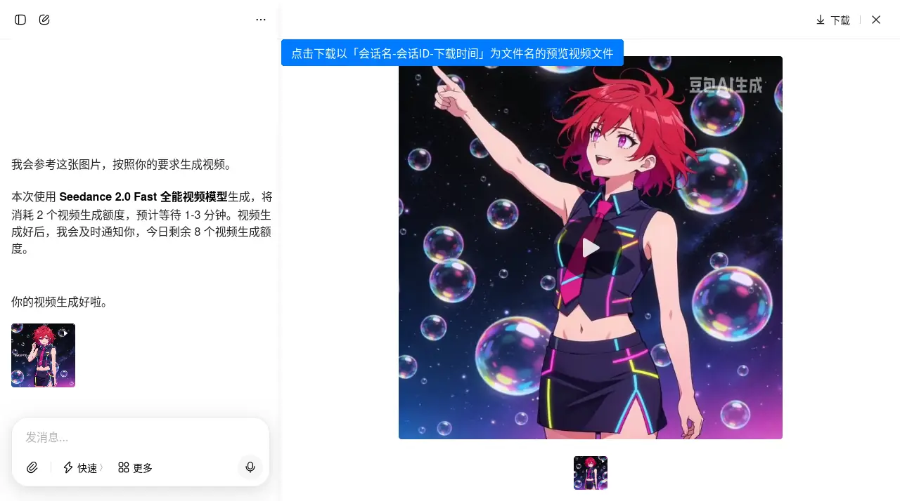

# 从豆包下载 ~无水印~ 图片 Download Origin Image from Doubao ~without Watermark~

目前本脚本提供 **下载预览图** 的功能。本脚本同时也提供 **下载预览视频** 的功能。

注意：豆包使用 **灰度发布**，同一时间有约2种不同版本的网页端，所以不同帐号下的页面结构可能不同。如果你的网页端暂未升级，可能会出现本脚本的新版本不适用的情况。如出现此类情况，请继续使用本脚本的旧版。

* * *

**豆包已经封杀了从网站上通过预览图直接获取无水印图片的方式。**

目前网页端给出的图片已自带水印，且其 _下载原图_ 功能下载的内容与预览图内容不同。不仅如此，如果使用线上的「视频生成」功能的话，豆包不是用服务器上的无水印原图生成，而是「用你浏览器看到的有水印的缩略图」来生成视频，然后还会再打一次水印上去。参见：<https://www.bilibili.com/video/BV1PG7KznEi4/>

请大家自行研究方法获取 无水印图片 的方法。

* * *

这曾是一个可以让你从 _[豆包（www.doubao.com）](https://www.doubao.com)_ 直接下载无水印图片 的 userscript 。

-   **重要提示**：此脚本可能随 _[豆包（www.doubao.com）](https://www.doubao.com)_ 网站的更新而失效。
-   **重要提示**：此脚本已因 _[豆包（www.doubao.com）](https://www.doubao.com)_ 网站更新而 **无法直接获取无水印图片**。

## 截图

## 使用说明

**请遵守法律、行政法规，尊重社会公德和伦理道德。如您生成或使用的内容导致公众混淆或者误认，因此所发生的后果和责任均由您自行承担。**

### 安装

#### ①安装用户脚本管理器

用户需先安装用户脚本管理器，推荐使用 **[篡改猴/油猴（Tampermonkey）](https://www.tampermonkey.net/)**：

-   [火狐附加组件](https://addons.mozilla.org/zh-CN/firefox/addon/tampermonkey/)
-   [Chrome 应用商店 扩展程序](https://chrome.google.com/webstore/detail/tampermonkey/dhdgffkkebhmkfjojejmpbldmpobfkfo?hl=zh-CN)
-   [Microsoft Edge 外接程序](https://microsoftedge.microsoft.com/addons/detail/tampermonkey/iikmkjmpaadaobahmlepeloendndfphd?hl=zh-CN&gl=CN)

或其他同类扩展程序。用户脚本管理器的安装等相关资料均可参见 [Greasy Fork](https://greasyfork.org/)。

#### ②安装本用户脚本

在完成安装用户脚本管理器后，安装本用户脚本。以下提供几个安装渠道：

-   【推荐】Greasyfork脚本安装地址：<https://greasyfork.org/scripts/527890>，点击页面上的 _安装此脚本_ 即可。
-   （Greasyfork镜像站）Greasyfork.icu脚本安装地址：<https://greasyfork.icu/zh-CN/scripts/527890>，点击页面上的 _安装此脚本_ 即可。
-   如果您访问 greasyfork.org 有困难，可以尝试这个 [GitHub链接](https://raw.githubusercontent.com/catscarlet/Download-Origin-Image-from-Doubao-without-Watermark/refs/heads/main/Download-Origin-Image-from-Doubao-without-Watermark.user.js) 进行安装。注意这个链接指向的地址为本项目的仓库，对应的文件可能比 Greasyfork 要新且可能包含一些新功能和不稳定的更改。

请注意：本脚本仅在 「Greasyfork 」与「GitHub」上进行发布和维护。对于镜像站可能产生的包括且不限于安全相关的问题概不负责。

### 使用

#### 1. 下载预览图片文件

成功安装本脚本后，在图片预览框体的左上角会新增一个 **「下载」** 按钮。点击后即可下载由 _当前标题+会话ID+下载时间_ 为文件名的预览图图片。

#### 2. 下载预览视频文件

本脚本同时也提供 **下载预览视频** 的功能。

成功安装本脚本后，在视频预览框体的左上角会新增一个 **「下载」** 按钮。点击后即可下载由 _当前标题+会话ID+下载时间_ 为文件名的预览视频文件。

### 兼容性

脚本可正确在以下用户脚本管理器中运行：

-   Tampermonkey: 5.4.0
-   Tampermonkey Legacy (MV2): 5.1.1

脚本可正确在以下浏览器中运行：

-   Firefox: 144.0.0
-   Firefox ESR: 115.22.0esr (Win7 可用)
-   Chrome: 109.0.5414.120 (Win7 可用)(Chrome版本小于120需要使用 Tampermonkey Legacy)

## 已知问题

-   开启脚本并访问豆包网站时，可能会给浏览器增加额外负担。对于配置较低的电脑可能会有性能影响，对于笔记本电脑使用电池时可能会增加额外的耗电。您可以在不使用此脚本的功能时，在脚本管理器中暂时关闭此脚本，仅在需要下载时开启。

* * *

## 源码

Github： <https://github.com/catscarlet/Download-Origin-Image-from-Doubao-without-Watermark>

## LICENSE

This project is licensed under **GNU AFFERO GENERAL PUBLIC LICENSE Version 3**
