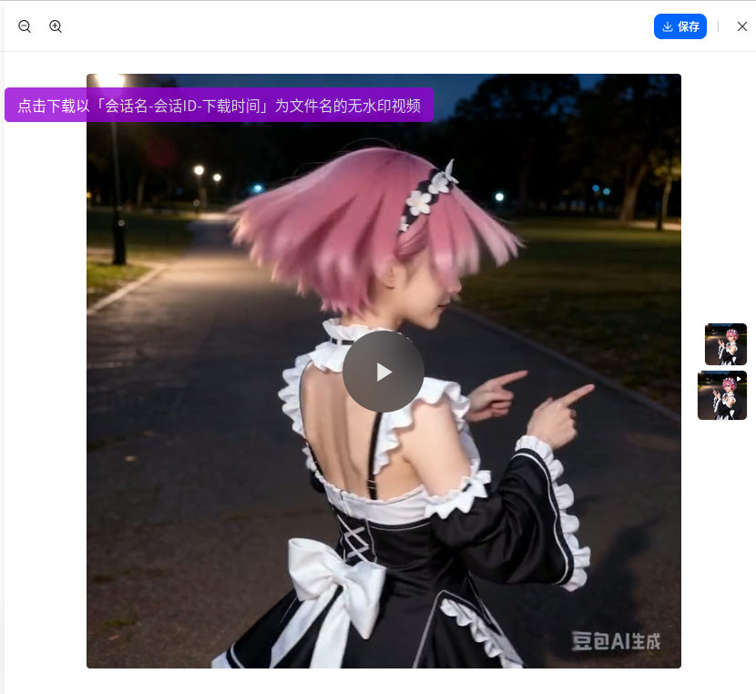
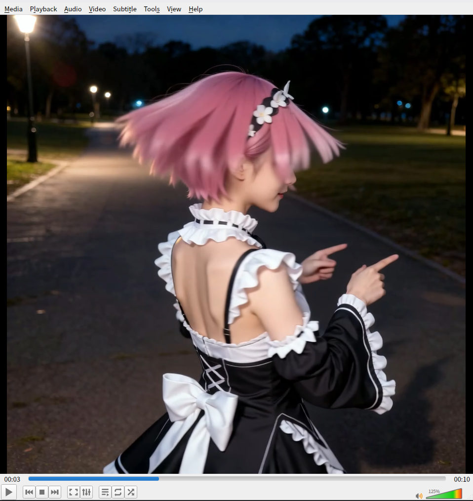

# 从豆包下载无水印原图和无水印视频实验版 Download Raw Image and Raw Video from doubao.com without Watermark Experimental

**重要提示**： **本脚本为学习实验性质。功能可靠性不高。个人目前精力有限，不会把重心放在这个脚本上。源码已提供，您可自行调整代码内容，请遵守 AGPLv3 开源协议。**

**重要提示**：此脚本可能随 _[豆包（www.doubao.com）](https://www.doubao.com)_ 网站的更新而失效。

注意：豆包网页端采用 **灰度发布** ，同一时间有约2种不同版本的网页端。如果你的网页端未升级，请使用上一个可用的版本，而非最新版。

这是一个可以让你从 _[豆包（www.doubao.com）](https://www.doubao.com)_ 直接下载无水印图片 的 userscript 。

* * *

## 截图

### 无水印图片下载

### 无水印视频下载

## 使用说明

**请遵守法律、行政法规，尊重社会公德和伦理道德。如您生成或使用的内容导致公众混淆或者误认，因此所发生的后果和责任均由您自行承担。**

### 安装

#### ①安装用户脚本管理器

用户需先安装用户脚本管理器，推荐使用 **[篡改猴/油猴（Tampermonkey）](https://www.tampermonkey.net/)**：

-   [火狐附加组件](https://addons.mozilla.org/zh-CN/firefox/addon/tampermonkey/)
-   [Chrome 应用商店 扩展程序](https://chrome.google.com/webstore/detail/tampermonkey/dhdgffkkebhmkfjojejmpbldmpobfkfo?hl=zh-CN)
-   [Microsoft Edge 外接程序](https://microsoftedge.microsoft.com/addons/detail/tampermonkey/iikmkjmpaadaobahmlepeloendndfphd?hl=zh-CN&gl=CN)

或其他同类扩展程序。用户脚本管理器的安装等相关资料均可参见 [Greasy Fork](https://greasyfork.org/)。

#### ②安装本用户脚本

在完成安装用户脚本管理器后，安装本用户脚本。以下提供几个安装渠道：

-   【推荐】Greasyfork脚本安装地址：<https://greasyfork.org/scripts/555118>，点击页面上的 _安装此脚本_ 即可
-   （Greasyfork镜像站）Greasyfork.icu脚本安装地址：<https://greasyfork.icu/zh-CN/scripts/555118>，点击页面上的 _安装此脚本_ 即可。
-   如果您访问 greasyfork.org 有困难，可以尝试这个 [GitHub链接](https://github.com/catscarlet/Download-Original-Raw-Image-from-Doubao-without-Watermark-Experimental/raw/refs/heads/main/Download-Original-Raw-Image-from-Doubao-without-Watermark-Experimental.user.js) 进行安装。注意这个链接指向的地址为本项目的仓库，对应的文件可能比 Greasyfork 要新且可能包含一些新功能和不稳定的更改。

请注意：本脚本仅在 「Greasyfork 」与「GitHub」上进行发布和维护。对于镜像站可能产生的包括且不限于安全相关的问题概不负责。

### 兼容性

脚本可正确在以下用户脚本管理器中运行：

-   Tampermonkey: 5.5.0
-   Tampermonkey Legacy (MV2): 5.1.1

脚本可正确在以下浏览器中运行：

-   Firefox: 152.0.1
-   Firefox ESR: 115.37.0esr (Win7 可用)
-   Chrome: 109.0.5414.120 (Win7 可用)(Chrome版本小于120需要使用 Tampermonkey Legacy)

### 使用

成功安装后，图片的左上角会新增一个 _下载按钮_ 。点击后会下载由 _当前标题+会话ID+下载时间_ 为文件名的图片。

### 已知缺陷

-   使用 智能编辑、区域重绘、扩图、擦除、变清晰 等编辑功能生成的图片无法下载。
-   在会话中新生成的的图片需要在页面刷新后才能下载。
-   部分会话的图片无法下载。
-   （20260601）版本0.1.0后有时会出现无法下载的情况，刷新可以解决。

本项目欢迎你提供代码修复这些问题。

## 源码

Github： <https://github.com/catscarlet/Download-Original-Raw-Image-from-Doubao-without-Watermark-Experimental>

## 关联项目

[Download Origin Image from Doubao without Watermark 从豆包下载预览图图片](https://greasyfork.org/scripts/527890)

## LICENSE

This project is licensed under **GNU AFFERO GENERAL PUBLIC LICENSE Version 3**
