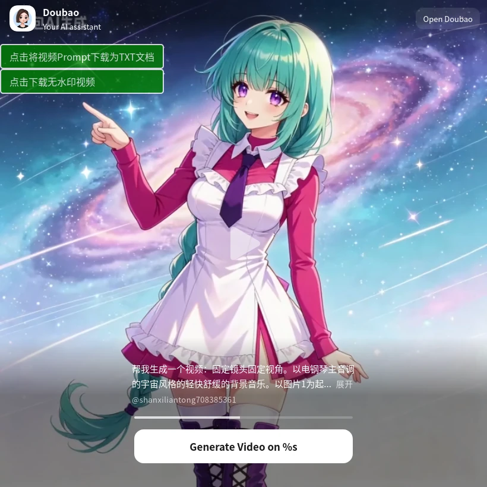
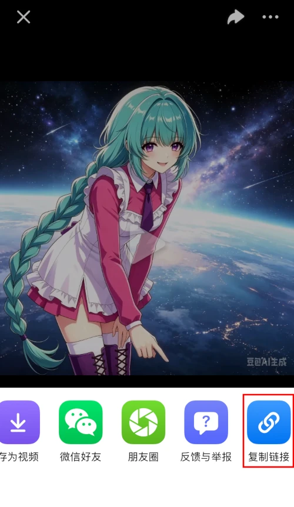
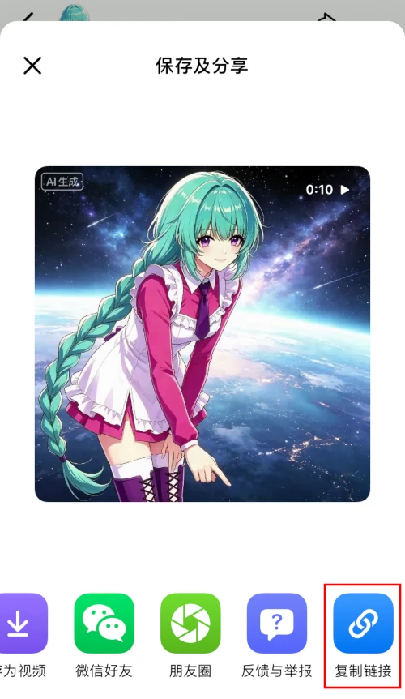
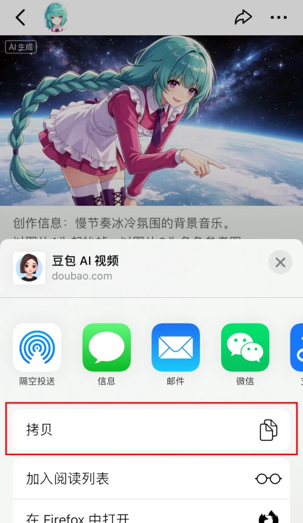

# 从豆包分享页面下载无水印视频 Download-from-Doubao-Video-Sharing-without-Watermark

**这是一个可以让你从豆包分享页面（`https://www.doubao.com/video-sharing`）下载无水印视频的 userscript 。**

**重要提示**：本脚本为学习实验性质。功能可靠性不高。个人目前精力有限，不会把重心放在这个脚本上。源码已提供，您可自行调整代码内容，请遵守 AGPLv3 开源协议。

**重要提示**：此脚本可能随 _[豆包（www.doubao.com）](https://www.doubao.com)_ 网站的更新而失效。

提示：如果你只想下载自己帐号下生成的视频，可以直接使用这个用户脚本：[Download Raw Image and Raw Video from doubao.com without Watermark Experimental 从豆包下载无水印原图和无水印视频实验版](https://greasyfork.org/scripts/555118)。免去在手机上「复制链接」的步骤。

* * *

## 截图

## 使用说明

**请遵守法律、行政法规，尊重社会公德和伦理道德。如您生成或使用的内容导致公众混淆或者误认，因此所发生的后果和责任均由您自行承担。**

### 安装

#### ①安装用户脚本管理器（如已安装可跳过）

用户需先安装用户脚本管理器，推荐使用 **[篡改猴/油猴（Tampermonkey）](https://www.tampermonkey.net/)**：

-   [火狐附加组件](https://addons.mozilla.org/zh-CN/firefox/addon/tampermonkey/)
-   [Chrome 应用商店 扩展程序](https://chrome.google.com/webstore/detail/tampermonkey/dhdgffkkebhmkfjojejmpbldmpobfkfo?hl=zh-CN)
-   [Microsoft Edge 外接程序](https://microsoftedge.microsoft.com/addons/detail/tampermonkey/iikmkjmpaadaobahmlepeloendndfphd?hl=zh-CN&gl=CN)

或其他同类扩展程序。用户脚本管理器的安装等相关资料均可参见 [Greasy Fork](https://greasyfork.org/)。

#### ②安装本用户脚本

在完成安装用户脚本管理器后，安装本用户脚本。以下提供几个安装渠道：

-   【推荐】Greasyfork脚本安装地址：<https://greasyfork.org/scripts/582844>，点击页面上的 _安装此脚本_ 即可
-   （Greasyfork镜像站）Greasyfork.icu脚本安装地址：<https://greasyfork.icu/zh-CN/scripts/582844>，点击页面上的 _安装此脚本_ 即可。
-   如果您访问 greasyfork.org 有困难，可以尝试这个 [GitHub链接](https://raw.githubusercontent.com/catscarlet/Download-from-Doubao-Video-Sharing-without-Watermark/refs/heads/main/Download-from-Doubao-Video-Sharing-without-Watermark.user.js) 进行安装。注意这个链接指向的地址为本项目的仓库，对应的文件可能比 Greasyfork 要新且可能包含一些新功能和不稳定的更改。

请注意：本脚本仅在 「Greasyfork 」与「GitHub」上进行发布和维护。对于镜像站可能产生的包括且不限于安全相关的问题概不负责。

### 使用

你需要在手机端App上打开对应的视频页面（他人的发布内容或自己的未发布内容都可以）。点击「分享按钮」，再点击「复制链接」（iOS亦可点击内置的「拷贝」），然后将复制的链接（以`https://www.doubao.com/video-sharing?`开头），使用已安装本用户脚本的浏览器打开。

打开页面后，页面的左上角会新增一组 _下载按钮_ 。您可以 **下载无水印视频** 和 **下载此视频的文生图提示词**

（提示：如果你只想下载自己帐号下生成的视频，可以直接使用这个用户脚本：[Download Raw Image and Raw Video from doubao.com without Watermark Experimental 从豆包下载无水印原图和无水印视频实验版](https://greasyfork.org/scripts/555118)。免去在手机上「复制链接」的步骤）

### 兼容性

脚本可正确在以下用户脚本管理器中运行：

-   Tampermonkey: 5.5.0
-   Tampermonkey Legacy (MV2): 5.1.1

脚本可正确在以下浏览器中运行：

-   Firefox: 151.0.4
-   Firefox ESR: 115.22.0esr (Win7 可用)
-   Chrome: 109.0.5414.120 (Win7 可用)(Chrome版本小于120需要使用 Tampermonkey Legacy)

## 源码

Github： <https://github.com/catscarlet/Download-from-Doubao-Video-Sharing-without-Watermark>

## 关联项目

-   [从豆包下载无水印原图和无水印视频实验版 Download Raw Image and Raw Video from doubao.com without Watermark Experimental](https://greasyfork.org/scripts/555118)，这个用户脚本可以帮助你下载自己豆包帐号下生成的内容
-   [从豆包下载 无水印 图片 Download Origin Image from Doubao without Watermark](https://greasyfork.org/scripts/527890)，这个用户脚本可以帮助你下载自己豆包帐号下生成的预览内容
-   [从即梦AI下载无水印视频和图片 Download Origin Video from JiMeng without Watermark](https://greasyfork.org/scripts/541644)，这个用户脚本可以帮助你下载自己即梦帐号下生成的预览内容

## 推荐项目

-   [scrcpy](https://github.com/Genymobile/scrcpy/)，这个应用可以让你更方便的使用电脑（Linux，Windows，macOS）操作安卓手机端，支持 **剪切板同步** 和 **文件推送** 等多种功能。

## LICENSE

This project is licensed under **GNU AFFERO GENERAL PUBLIC LICENSE Version 3**
