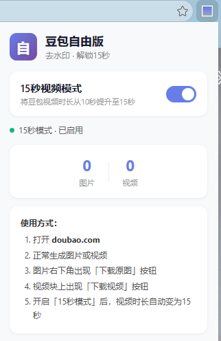
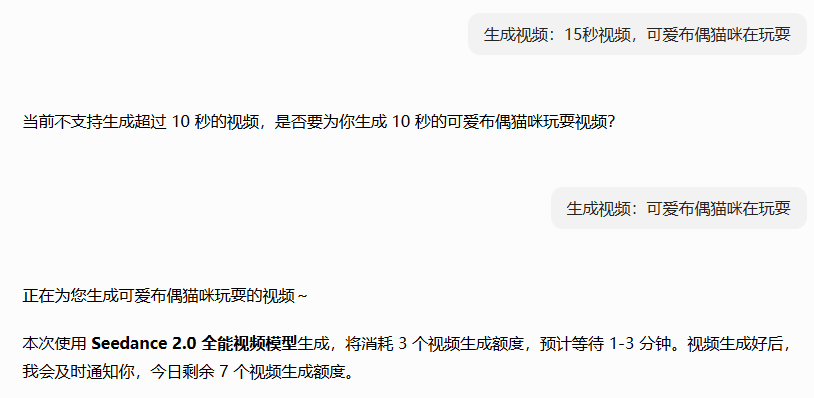

# 豆包自由版 / Doubao Free

> **中文:** 豆包视频/图片无水印下载 + 解锁15秒视频生成 · 开源免费 · 纯净无验证  
> **English:** Watermark-free download and 15-second video unlock for Doubao · Open-source, free, no verification

<p align="center">
  
</p>

---

## 功能 / Features

| 中文 | English |
|---|---|
| ✅ **图片无水印下载** — 一键保存无水印原图 | ✅ **Watermark-free image download** — Save original images with one click |
| ✅ **视频无水印下载** — 一键下载无水印MP4 | ✅ **Watermark-free video download** — Download clean MP4 videos |
| ✅ **15秒视频生成** — 豆包默认限10秒，本插件解锁至15秒 | ✅ **15-second video** — Doubao limits to 10s; this plugin unlocks 15s |
| ✅ **无任何付费验证** — 无卡密、无会员、无后门 | ✅ **No payment or verification** — No license keys, no paywall, no backdoor |

---

## 原理 / How It Works

### 去水印 / Watermark Removal
**中文:** 豆包后端实际已返回无水印的图片/视频URL，只是前端展示时加了水印层。本插件劫持 `JSON.parse` 和网络请求，提取原始无水印地址，直接在页面上提供下载入口。

**English:** Doubao's backend already returns watermark-free image/video URLs — the watermark is only a front-end overlay. This plugin hooks `JSON.parse` and network requests to extract the original clean URLs and provides download buttons directly on the page.

### 15秒 / 15-Second Video
**中文:** Seedance 2.0 模型原生支持 4~15秒视频生成，豆包在前端 UI 上仅开放了 5秒和10秒选项。本插件拦截视频生成请求，修改 `duration` 参数为 15，让后端模型生成完整 15秒视频。

**English:** The Seedance 2.0 model natively supports 4–15 second video generation, but Doubao's UI only exposes 5s and 10s options. This plugin intercepts video generation requests, patches the `duration` parameter to 15, and lets the backend produce the full 15-second output.

---

## 安装 / Installation

### 前置条件 / Prerequisites
- **中文:** Chrome 或 Edge 浏览器
- **English:** Chrome or Edge browser

### 安装步骤 / Steps

| # | 中文 | English |
|---|---|---|
| 1 | **下载本插件文件夹**，放在一个**不要移动**的位置 | **Download the plugin folder** and keep it in a **permanent location** |
| 2 | **打开浏览器扩展管理页** — Chrome: `chrome://extensions/` · Edge: `edge://extensions/` | **Open the extension management page** — Chrome: `chrome://extensions/` · Edge: `edge://extensions/` |
| 3 | **开启「开发人员模式」** | **Enable "Developer mode"** (top right) |
| 4 | **点击「加载已解压的扩展」**，选择本插件文件夹 | **Click "Load unpacked"** and select the plugin folder |
| 5 | **重启浏览器**，工具栏出现蓝色方块图标 | **Restart your browser** — a blue square icon appears in your toolbar |

---

## 使用 / Usage

### 下载无水印图片/视频 / Download Without Watermarks

| 中文 | English |
|---|---|
| 1. 打开 [doubao.com](https://www.doubao.com/) | 1. Open [doubao.com](https://www.doubao.com/) |
| 2. 正常使用豆包生成图片或视频 | 2. Generate images or videos as usual |
| 3. 图片右下角出现 **「下载原图」** 按钮，点击保存 | 3. A **"Download"** button appears on images — click to save |
| 4. 视频块上出现 **「下载视频」** 按钮，点击保存 | 4. A **"Download"** button appears on videos — click to save |

### 开启15秒模式 / Enable 15s Mode

| 中文 | English |
|---|---|
| 1. 点击工具栏蓝色方块图标打开弹窗 | 1. Click the blue square icon in the toolbar |
| 2. 打开 **「15秒视频模式」** 开关 | 2. Toggle **"15s Video Mode"** on |
| 3. 之后生成的视频自动变为15秒 | 3. All subsequent videos will be 15 seconds |
| 4. 关闭开关即可恢复默认时长 | 4. Toggle off to restore default duration |

> ⚠️ **重要：** 开启15秒模式后，提示词中不要写「15秒」或任何超过10秒的时长描述，否则豆包会拒绝生成（提示「不支持超过10秒」），并提示生成10秒，如果继续生成的话就会变成10秒，导致插件失效。去除时间提示词描述即可。  
> **Important:** After enabling 15s mode, **do NOT write "15 seconds" or any duration over 10s in your prompt** — Doubao will reject it and suggest 10 seconds instead. If you proceed, it becomes 10 seconds and the plugin's 15s mode won't work. Simply remove the duration from your prompt.

<p align="center">
  
</p>

---

## 文件结构 / File Structure

```
doubao-free/
├── manifest.json    # 扩展配置 / Extension manifest
├── content.js       # 核心逻辑（注入豆包页面） / Core logic (injected into Doubao)
├── forwarder.js     # 消息桥接 / Message bridge (MAIN ↔ Service Worker)
├── background.js    # 后台服务（下载处理） / Background service (downloads)
├── popup.html       # 弹窗页面 / Popup page
├── popup.js         # 弹窗逻辑 / Popup logic
├── popup.css        # 弹窗样式 / Popup styles
├── icon.png         # 图标 / Icon
└── README.md        # 本文件 / This file
```

---

## 注意事项 / Notes

| 中文 | English |
|---|---|
| 安装后**重启浏览器**生效。文件夹**不要删除或移动**，否则扩展会失效 | **Restart your browser** after installation. Do **not** delete or move the folder, or the extension will break |
| 失效时在 `chrome://extensions/` 点刷新按钮重载 | If it stops working, click the refresh button in `chrome://extensions/` |
| 视频下载需要保持豆包账号**登录状态** | You must be **logged in** to Doubao for video downloads |
| 如豆包更新接口导致异常，请提交 Issue | If Doubao's API changes break functionality, please open an Issue |

---

## 许可证 / License

MIT License — 自由使用、修改、分发 / Free to use, modify, and distribute.
