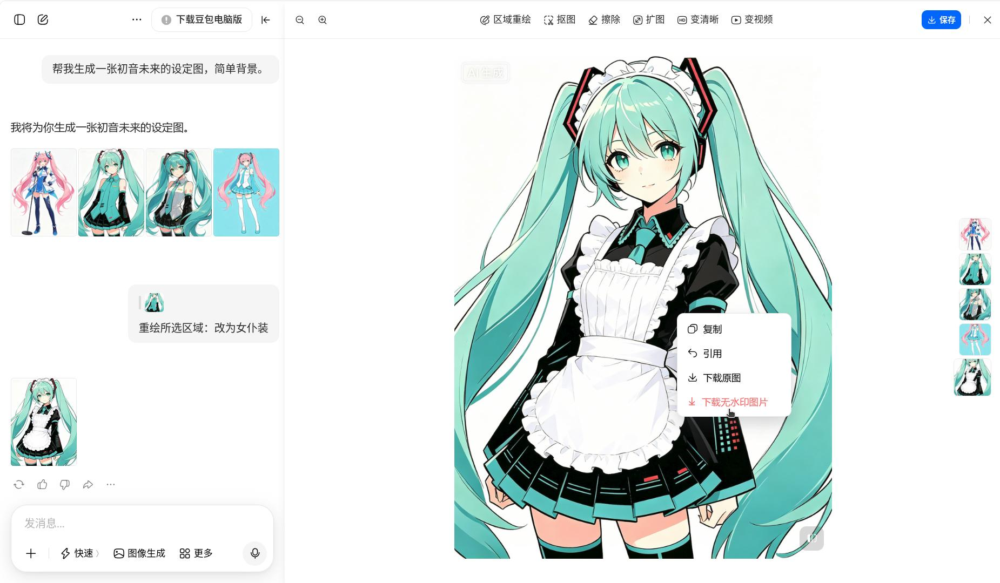
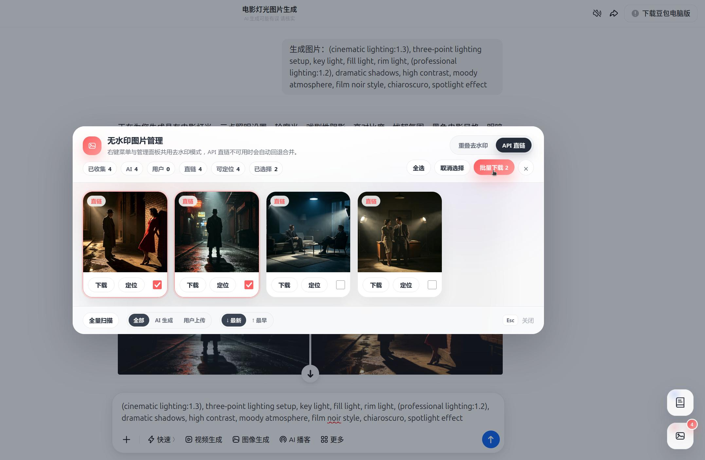
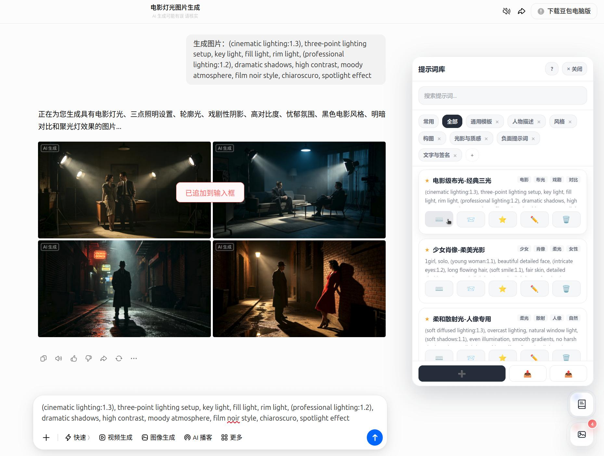

# 豆包无水印图片下载（油猴脚本）

一个为豆包网站添加无水印图片下载与提示词管理功能的用户脚本。无损去除水印。

> [!NOTE]
>
> 时效：2026.6.17 测试有效
>
> 后期随时可能失效。如果不是因为原理破坏而失效，可以提PR/Issue，会在1天内答复。
>
> ***安装油猴脚本 👉 [(GreasyFork) 豆包无水印图片下载](https://greasyfork.org/scripts/544607) | [(GitHub Release) 豆包无水印图片下载](https://github.com/Qalxry/doubao-no-watermark/releases/latest)***



## 功能特性

### 🖼️ 无水印下载

- ⚡ 目前 <u>***唯一支持下载无水印编辑后图片***</u> 的方案
- 🖱️ **右键一键下载**：在豆包生成的图片上右键，选择「下载无水印原图」即可
- 🔄 **双模式下载**：API 直链优先（直接下载无水印原图），不可用时自动回退重叠去水印
- 💾 一键下载处理后的高质量 PNG 图片

### 📋 图片管理面板



- 🎛️ **悬浮按钮**：页面右下角固定悬浮按钮，显示已收集图片数量角标
- 🗂️ **图片网格浏览**：缩略图预览、分辨率标注、下载模式提示
- ✅ **批量选择下载**：勾选多张图片，一键打包为 ZIP 下载（纯前端打包，无外部依赖）
- 🔍 **来源筛选**：按「全部」「AI 生成」「用户上传」过滤图片
- ⏱️ **时间排序**：最新在前 / 最早在前，自由切换
- 📍 **定位跳转**：点击「定位」按钮自动滚动到对话中对应图片并高亮
- 🔄 **全量扫描**：自动滚动对话列表，触发懒加载，一次性收集所有历史图片
- 🧭 **会话隔离**：切换对话自动清空缓存，SPA 路由变化实时感知

### 📝 提示词库



- 📚 **分类管理**：内置 7 个默认分类（通用模板、人物描述、风格、构图、光影与质感、负面提示词、文字与签名），支持自定义增删
- 🎨 **拖拽排序**：分类标签和提示词卡片均可拖拽重排，带 FLIP 动画
- ⭐ **收藏置顶**：收藏的提示词自动置顶展示，配合「常用」智能排序（基于使用频率与最近使用时间）
- 🔎 **搜索过滤**：支持按标题、内容、标签搜索，实时筛选
- 🏷️ **标签系统**：每条提示词支持多个标签，方便分类检索

### 🧩 模板变量系统

- `{变量名}` 定义占位符，支持设置默认值 `{变量名='默认值'}`
- 支持**顺序传参**（`'猫|花园|水彩'`）、**命名传参**（`'主体=猫|风格=水彩'`）、**混用传参**
- 支持空位跳过（`'猫||水彩'`）和转义（`\|` `\\` `\n`）
- 「只填」追加到输入框，「填发」填入后自动点击发送按钮

### 💾 数据管理

- 📥 **JSON 导入导出**：完整的备份与恢复，支持跨设备迁移
- ⚔️ **智能冲突处理**：导入时自动检测 ID 冲突，支持「全部替换」「按时间最新」「全部跳过」及逐条手动选择

## 特别说明

### 1. 脚本原理

豆包【下载图片】水印在右下角，但【网页图片】水印却在左上角。

把【网页图片】的右下角覆盖到【下载图片】上，即可得到无水印图片。

另外，豆包 API 在某些版本中提供了无水印原图字段，脚本优先通过 API 直链下载，无需合并处理。若该字段不可用，自动回退重叠合并。

### 2. 图片收集机制

脚本通过**双通道**收集图片：

- **DOM 扫描**：定时扫描页面中的 `` 和 `<canvas>` 元素，通过 React Fiber 遍历提取图片 URL 对
- **API 拦截**：拦截 XHR（`/im/chain/single`）和 Fetch（`/chat/completion`），从响应中直接提取图片信息

这确保即使图片未渲染到可视区域，也能被收集到管理面板中。

## 安装方法

1. 安装 [Tampermonkey](https://www.tampermonkey.net/) 浏览器扩展
2. [通过 GreasyFork](https://greasyfork.org/scripts/544607) 或 [通过 GitHub Release](https://github.com/Qalxry/doubao-no-watermark/releases/latest) 安装油猴脚本
3. 确保脚本已启用

## 使用方法

### 无水印下载

1. 访问 [豆包](https://www.doubao.com/) 网站
2. 生成图片后，**右键点击**生成的图片
3. 在弹出的菜单中选择「**下载无水印原图**」
4. 等待处理完成，图片将自动下载

### 图片管理面板

1. 点击页面**右下角**的红色悬浮按钮（图标：🖼️）
2. 面板中可查看所有已收集的图片缩略图
3. 勾选图片，点击「批量下载」打包为 ZIP
4. 使用顶部切换按钮选择下载模式（API 直链 / 重叠去水印）
5. 点击「全量扫描」自动收集历史对话中的所有图片

### 提示词库

1. 点击页面**右下角上方**的蓝色悬浮按钮（图标：📖）
2. 在面板中浏览、搜索、管理提示词
3. 点击「只填」将提示词追加到豆包输入框
4. 点击「填发」将提示词填入并自动发送
5. 支持通过 Tampermonkey 菜单栏「打开提示词库」快捷打开

### 模板变量使用

在输入框中输入参数，格式为引号包裹、`|` 分隔：

```plaintext
'猫|花园|水彩'
```

然后点击提示词的「只填」或「填发」，变量会自动替换。

## 许可证

GPL-3.0 License

## 特别鸣谢

感谢 [@Zhanghuaimin-233](https://github.com/Zhanghuaimin-233) 为该项目做出的大量贡献：

- **[PR#1](https://github.com/Qalxry/doubao-no-watermark/pull/1)**：适配豆包新版页面结构，重构图片获取与合并逻辑，解决 Alpha 通道问题和奇数像素取整问题
- **[PR#9](https://github.com/Qalxry/doubao-no-watermark/pull/9)**：图片管理面板核心功能——网格浏览、来源筛选、时间排序、定位跳转、全量扫描、会话隔离、选择状态与批量下载进度持久化、事件委托重构、统计栏等
- **[PR#10](https://github.com/Qalxry/doubao-no-watermark/pull/10)**：修复侧栏画布右键菜单注入问题
- **[PR#11](https://github.com/Qalxry/doubao-no-watermark/pull/11)**：内置提示词库面板——分类管理、搜索过滤、拖拽排序、收藏置顶、模板变量系统、JSON 导入导出与冲突处理

---

⚠️ **免责声明**: 本脚本仅供学习交流使用，请遵守相关网站的使用条款。
